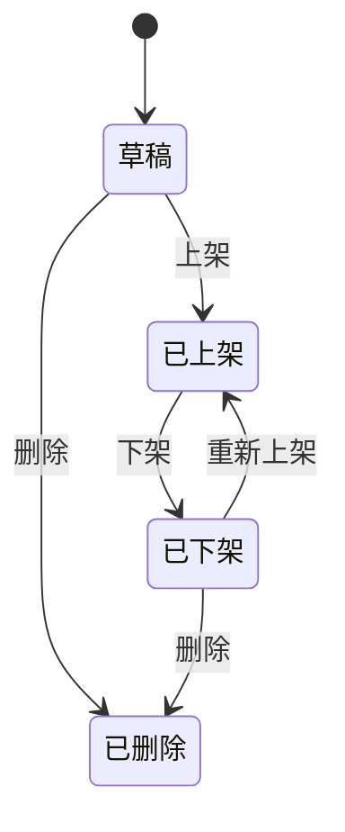

# 快手选品运营瓷片区与商品专题 PRD

> 历史版本说明：本文档为早期单文件 PRD 草稿，已被新产品事实源文档组取代。后续请以 `项目导航.md`、`版本边界.md`、`产品事实源.md`、`三方接口依赖.md`、`验收测试矩阵.md`、`风险与待确认.md` 为准。

## 1. 文档信息

| 项目 | 内容 |
| --- | --- |
| 产品名称 | 抖老板快手选品 |
| 需求模块 | 运营瓷片区、商品专题、埋点统计 |
| 终端范围 | 小程序、管理后台 |
| 技术约束 | 小程序/移动端：uni-app；管理后台 Web：Vue3 + Arco Design；后端：Python/Golang；数据库：MySQL |
| 文档版本 | V1.0 |
| 创建日期 | 2026-05-27 |

## 目录

1. 文档信息
2. 背景与目标
3. 需求范围
4. 角色与使用场景
5. 模块一：快手选品首页运营瓷片区
6. 模块二：快手商品专题
7. 埋点与数据统计
8. 接口需求建议
9. 数据表设计建议
10. 异常与边界场景
11. 权限需求
12. 验收标准
13. 待确认问题

## 2. 背景与目标

### 2.1 背景

当前快手选品首页已有搜索、金刚区、商品列表与筛选能力，但运营资源位不足，无法灵活承接活动、专题、外部 H5 或指定小程序页面。同时，商品专题能力不完整，运营无法在后台沉淀专题货盘、分类专题，并对用户访问和商品转化行为进行统计分析。

### 2.2 目标

1. 在快手选品首页新增运营瓷片区，用于承载主推资源位与次级资源位。
2. 后台支持对每个瓷片位单独配置内容、封面和点击跳转。
3. 新增快手商品专题能力，支持专题列表、专题分类、专题详情与专题货盘配置。
4. 支持专题从金刚区入口进入，并支持瓷片区跳转到指定专题。
5. 建立瓷片区和专题相关埋点，满足后续用户行为分析与转化统计。

## 3. 需求范围

### 3.1 本期包含

1. 小程序快手选品首页新增运营瓷片区。
2. 小程序新增商品专题列表页、专题详情页。
3. 小程序金刚区新增“商品专题”入口。
4. 管理后台新增瓷片区配置能力。
5. 管理后台新增专题管理、专题分类管理、专题货盘组建能力。
6. 新增瓷片点击埋点、专题访问埋点、专题商品转化埋点。

### 3.2 本期不包含

1. 复杂个性化推荐算法。
2. 专题自动生成能力。
3. 多人审批流。
4. A/B 实验配置。
5. 复杂数据看板，仅要求具备明细记录和基础统计可扩展的数据基础。

## 4. 角色与使用场景

| 角色 | 使用场景 |
| --- | --- |
| 小程序用户 | 浏览首页运营瓷片、进入专题列表、查看专题详情、筛选专题商品、点击商品、添加货架、复制商品 ID/口令 |
| 运营人员 | 配置首页瓷片内容、维护专题分类、创建和编辑专题、组建专题货盘、上下架专题 |
| 数据/运营分析人员 | 查看瓷片点击明细、统计专题访问用户、分析专题内商品转化行为 |

## 5. 模块一：快手选品首页运营瓷片区

### 5.1 小程序展示需求

#### 5.1.1 展示位置

运营瓷片区展示在快手选品首页金刚区下方、商品分类 Tab 上方，对应当前首页截图中红框标注位置。

#### 5.1.2 布局结构

瓷片区采用“1 大 + 4 小”的组合布局：

| 区域 | 数量 | 定位 | 展示说明 |
| --- | ---: | --- | --- |
| 大瓷片 | 1 个 | 主推资源位 | 展示在左侧，占据更大视觉面积 |
| 小瓷片 | 4 个 | 次级资源位 | 展示在右侧，2 行 2 列 |

布局参考：

```text
┌──────────────┐  ┌──────────┐ ┌──────────┐
│              │  │ 小瓷片 1 │ │ 小瓷片 2 │
│   大瓷片     │  └──────────┘ └──────────┘
│              │  ┌──────────┐ ┌──────────┐
│              │  │ 小瓷片 3 │ │ 小瓷片 4 │
└──────────────┘  └──────────┘ └──────────┘
```

#### 5.1.3 展示规则

1. 瓷片区仅在存在可展示内容时显示。
2. 大瓷片支持最多同时配置 3 条内容，小程序端展示时默认轮播展示。
3. 小瓷片每个位置最多同时配置 1 条内容，不轮播。
4. 若大瓷片无可展示内容，则隐藏大瓷片区域；小瓷片仍可按剩余区域展示，具体 UI 可由设计稿确认。
5. 若某个小瓷片无可展示内容，则该小瓷片位置隐藏或使用占位策略，建议本期采用隐藏。
6. 瓷片封面需要根据大瓷片、小瓷片尺寸分别上传和展示，前端等比裁切或按配置尺寸适配。
7. 点击瓷片后根据后台配置的跳转类型执行跳转。

### 5.2 管理后台配置需求

#### 5.2.1 页面入口

建议在管理后台增加菜单：

```text
快手选品管理 / 运营瓷片配置
```

#### 5.2.2 瓷片位管理

后台固定维护 5 个瓷片位：

| 瓷片位编码 | 瓷片位名称 | 类型 | 内容上限 |
| --- | --- | --- | ---: |
| main | 主推资源位 | 大瓷片 | 3 |
| sub_1 | 次级资源位 1 | 小瓷片 | 1 |
| sub_2 | 次级资源位 2 | 小瓷片 | 1 |
| sub_3 | 次级资源位 3 | 小瓷片 | 1 |
| sub_4 | 次级资源位 4 | 小瓷片 | 1 |

每个瓷片位支持单独配置内容。

#### 5.2.3 瓷片内容字段

| 字段 | 是否必填 | 说明 |
| --- | --- | --- |
| 内容名称 | 是 | 后台识别用名称，不一定前台展示 |
| 瓷片位 | 是 | main/sub_1/sub_2/sub_3/sub_4 |
| 封面图 | 是 | 按瓷片位尺寸上传，大瓷片和小瓷片可使用不同尺寸规范 |
| 跳转类型 | 是 | 商品专题、小程序路由、H5 |
| 跳转目标 | 是 | 根据跳转类型配置 |
| 排序 | 否 | 大瓷片多内容轮播时按排序展示；小瓷片仅用于后台排序展示 |
| 上架状态 | 是 | 上架/下架 |
| 生效时间 | 否 | 可选，未配置则立即生效 |
| 失效时间 | 否 | 可选，未配置则长期有效 |
| 创建人 | 自动 | 记录后台操作人 |
| 更新时间 | 自动 | 记录最后更新时间 |

#### 5.2.4 跳转类型与配置

| 跳转类型 | 配置方式 | 小程序行为 |
| --- | --- | --- |
| 商品专题 | 选择专题 ID / 专题名称 | 跳转至专题详情页 |
| 小程序路由 | 手动填写或选择 route，例如 `/pages/topic/index?id=xxx` | 调用小程序内部页面跳转 |
| H5 | 填写 URL | 跳转至 WebView 页面或小程序支持的 H5 承载页 |

#### 5.2.5 操作能力

1. 查看瓷片位列表。
2. 查看每个瓷片位下已配置内容。
3. 新增瓷片内容。
4. 编辑瓷片内容。
5. 上架/下架瓷片内容。
6. 删除瓷片内容。
7. 调整大瓷片内容排序。
8. 查看单条瓷片内容的用户点击明细。

#### 5.2.6 校验规则

1. 大瓷片位同一时间最多允许 3 条上架且在有效期内的内容。
2. 每个小瓷片位同一时间最多允许 1 条上架且在有效期内的内容。
3. 封面图必填，且需符合当前瓷片位尺寸要求。
4. 跳转类型为“商品专题”时，专题必须存在，且建议仅允许选择已上架专题。
5. 跳转类型为“H5”时，URL 必须为合法 `http://` 或 `https://` 地址。
6. 跳转类型为“小程序路由”时，route 必须以 `/` 开头。
7. 生效时间不得晚于失效时间。

## 6. 模块二：快手商品专题

### 6.1 小程序展示需求

#### 6.1.1 金刚区入口

在快手选品首页金刚区新增“商品专题”入口。

点击后进入商品专题列表页。

#### 6.1.2 专题列表页

页面内容：

1. 顶部 Banner，可由运营配置或使用默认图。
2. 专题分类 Tab，例如“热门专题”“玩具乐器”“服饰内衣”“个护家清”“智能家”等。
3. 专题列表卡片。
4. 每个专题卡片展示专题名称、专题副标题或描述、专题商品预览。

专题列表展示规则：

1. 默认选中第一个上架分类，建议为“热门专题”。
2. 分类 Tab 支持横向滚动。
3. 仅展示已上架专题。
4. 下架或删除专题不展示。
5. 点击专题卡片进入专题详情页。

#### 6.1.3 专题详情页

页面内容：

1. 页面标题：专题名称。
2. 搜索框：支持在当前专题货盘内搜索商品。
3. 专题头图/封面。
4. 商品筛选区。
5. 商品列表。

商品筛选能力：

| 筛选项 | 说明 |
| --- | --- |
| 综合 | 默认排序 |
| 最新上架 | 按商品上架时间排序 |
| 2h 销量 | 按 2 小时销量排序 |
| 昨日销量 | 按昨日销量排序 |
| 7日销量 | 按 7 日销量排序 |
| 佣金率 | 按佣金率排序 |
| 价格 | 按价格排序 |

如现有商品列表已有筛选组件，应尽量复用现有能力。

商品卡片操作：

1. 点击商品进入商品详情或执行现有商品点击逻辑。
2. 支持添加货架。
3. 支持复制商品 ID/口令。
4. 以上行为需要记录专题转化埋点。

#### 6.1.4 瓷片区配置显示

商品专题可作为瓷片区跳转目标。用户点击瓷片后，如果跳转类型为“商品专题”，进入对应专题详情页。

### 6.2 管理后台配置需求

#### 6.2.1 菜单入口

建议在管理后台增加菜单：

```text
快手选品管理 / 商品专题管理
快手选品管理 / 专题分类管理
```

### 6.3 专题分类管理

#### 6.3.1 分类字段

| 字段 | 是否必填 | 说明 |
| --- | --- | --- |
| 分类名称 | 是 | 前台 Tab 展示名称 |
| 排序 | 否 | 数值越小越靠前 |
| 状态 | 是 | 启用/停用 |
| 创建时间 | 自动 | 系统生成 |
| 更新时间 | 自动 | 系统生成 |

#### 6.3.2 分类操作

1. 新增分类。
2. 编辑分类。
3. 启用/停用分类。
4. 删除分类。
5. 调整分类排序。

#### 6.3.3 分类规则

1. 分类名称不可为空。
2. 同一业务范围内分类名称不建议重复。
3. 已有关联专题的分类删除时需提示，建议本期不允许删除，只允许停用。
4. 停用分类后，小程序端不展示该分类 Tab。

### 6.4 专题管理

#### 6.4.1 专题列表

后台专题列表字段：

| 字段 | 说明 |
| --- | --- |
| 专题 ID | 系统生成 |
| 专题名称 | 运营配置 |
| 专题分类 | 运营选择 |
| 专题封面 | 运营上传 |
| 商品数量 | 当前专题货盘商品数 |
| 状态 | 草稿/已上架/已下架 |
| 排序 | 前台展示排序 |
| 创建人 | 后台操作人 |
| 创建时间 | 系统生成 |
| 更新时间 | 系统生成 |

支持筛选：

1. 专题名称。
2. 专题 ID。
3. 专题分类。
4. 状态。
5. 创建时间。

#### 6.4.2 新增/编辑专题字段

| 字段 | 是否必填 | 说明 |
| --- | --- | --- |
| 专题名称 | 是 | 小程序专题列表和详情页展示 |
| 专题副标题/描述 | 否 | 小程序专题卡片可展示 |
| 专题分类 | 是 | 选择已启用分类 |
| 专题封面 | 是 | 专题列表卡片、专题详情头图展示 |
| 专题货盘 | 是 | 选择商品组成专题商品列表 |
| 排序 | 否 | 同分类下展示排序 |
| 状态 | 是 | 草稿/上架/下架 |

#### 6.4.3 专题货盘组建

专题货盘组建支持：

1. 按商品 ID 添加。
2. 按商品名称/关键词搜索后添加。
3. 批量导入商品 ID。
4. 移除已选商品。
5. 调整商品排序。
6. 查看已选商品数量。

专题货盘商品字段建议展示：

| 字段 | 说明 |
| --- | --- |
| 商品 ID | 商品唯一标识 |
| 商品名称 | 商品标题 |
| 商品主图 | 商品图片 |
| 价格 | 商品售价 |
| 佣金 | 商品佣金 |
| 佣金率 | 商品佣金率 |
| 销量 | 关键销量指标 |
| 状态 | 商品是否可售/有效 |

#### 6.4.4 专题操作

| 操作 | 说明 |
| --- | --- |
| 新增 | 创建专题，可保存为草稿或直接上架 |
| 编辑 | 修改专题基础信息和货盘 |
| 上架 | 专题在小程序端可见 |
| 下架 | 专题在小程序端不可见 |
| 删除 | 删除专题，建议仅草稿/已下架状态可删除 |

#### 6.4.5 状态流转



#### 6.4.6 校验规则

1. 专题名称必填，建议限制 2-30 个字符。
2. 专题封面必填。
3. 专题分类必选，且分类需为启用状态。
4. 专题上架前必须至少包含 1 个有效商品。
5. 删除专题前需判断是否被瓷片区引用；如被引用，应阻止删除并提示先取消瓷片配置。
6. 已上架专题可以编辑，编辑后小程序端实时或经缓存刷新后生效。

## 7. 埋点与数据统计

### 7.1 瓷片区点击埋点

#### 7.1.1 触发时机

用户点击任一运营瓷片时触发。

#### 7.1.2 记录内容

| 字段 | 说明 |
| --- | --- |
| event_name | 固定为 `ks_tile_click` |
| user_id | 用户 ID |
| click_time | 点击时间 |
| tile_slot_code | 瓷片位编码：main/sub_1/sub_2/sub_3/sub_4 |
| tile_slot_name | 瓷片位名称 |
| tile_content_id | 瓷片内容 ID |
| tile_content_name | 瓷片内容名称 |
| cover_url | 点击时展示的封面 |
| jump_type | 跳转类型：topic/route/h5 |
| jump_target | 跳转目标 |
| topic_id | 如果跳转类型为商品专题，则记录专题 ID |
| source_page | 来源页面，例如快手选品首页 |
| platform | 平台，例如快手 |

#### 7.1.3 后台查看

后台在瓷片内容详情页支持查看点击明细：

1. 用户 ID。
2. 点击时间。
3. 瓷片位。
4. 瓷片内容。
5. 跳转类型。
6. 跳转目标。

支持按时间范围筛选，支持分页。

### 7.2 专题访问埋点

#### 7.2.1 触发时机

用户进入专题详情页时触发。

#### 7.2.2 去重规则

一天内，同一用户访问同一专题只记录一次。

去重口径：

```text
date + user_id + topic_id
```

#### 7.2.3 记录内容

| 字段 | 说明 |
| --- | --- |
| event_name | 固定为 `ks_topic_visit` |
| stat_date | 访问日期 |
| user_id | 用户 ID |
| topic_id | 专题 ID |
| topic_name | 专题名称 |
| category_id | 专题分类 ID |
| category_name | 专题分类名称 |
| first_visit_time | 当日首次访问时间 |
| source | 来源：金刚区入口/瓷片区/分享/其他 |
| source_detail | 来源详情，例如瓷片内容 ID |
| platform | 平台，例如快手 |

### 7.3 专题转化埋点

#### 7.3.1 触发行为

用户访问专题后的以下行为需要记录：

1. 商品点击。
2. 添加货架。
3. 复制商品 ID。
4. 复制口令。

#### 7.3.2 记录内容

| 字段 | 说明 |
| --- | --- |
| event_name | `ks_topic_product_click` / `ks_topic_add_shelf` / `ks_topic_copy_product_id` / `ks_topic_copy_command` |
| user_id | 用户 ID |
| event_time | 行为发生时间 |
| topic_id | 专题 ID |
| topic_name | 专题名称 |
| product_id | 商品 ID |
| product_name | 商品名称 |
| product_position | 商品在专题列表中的位置 |
| category_id | 专题分类 ID |
| source_page | 专题详情页 |
| platform | 平台，例如快手 |

### 7.4 数据统计建议

本期至少保留明细数据，便于后续扩展统计看板。建议支持以下基础统计：

| 统计项 | 口径 |
| --- | --- |
| 瓷片点击人数 UV | 指定时间内点击瓷片的去重用户数 |
| 瓷片点击次数 PV | 指定时间内瓷片点击总次数 |
| 专题访问人数 UV | 指定时间内访问专题的去重用户数 |
| 专题访问次数 | 本期按“一天一用户一专题一次”规则统计 |
| 商品点击次数 | 专题详情页内商品点击总次数 |
| 添加货架次数 | 专题详情页内添加货架总次数 |
| 复制 ID/口令次数 | 专题详情页内复制行为总次数 |

## 8. 接口需求建议

### 8.1 小程序接口

| 接口 | 用途 |
| --- | --- |
| `GET /api/ks/tiles` | 获取快手首页运营瓷片区配置 |
| `POST /api/ks/tiles/click` | 上报瓷片点击埋点 |
| `GET /api/ks/topic/categories` | 获取专题分类 |
| `GET /api/ks/topics` | 获取专题列表 |
| `GET /api/ks/topics/{topic_id}` | 获取专题详情 |
| `GET /api/ks/topics/{topic_id}/products` | 获取专题商品列表 |
| `POST /api/ks/topics/{topic_id}/visit` | 上报专题访问 |
| `POST /api/ks/topics/{topic_id}/product-events` | 上报专题商品转化行为 |

### 8.2 管理后台接口

| 接口 | 用途 |
| --- | --- |
| `GET /admin/ks/tile-slots` | 获取瓷片位列表 |
| `GET /admin/ks/tile-contents` | 获取瓷片内容列表 |
| `POST /admin/ks/tile-contents` | 新增瓷片内容 |
| `PUT /admin/ks/tile-contents/{id}` | 编辑瓷片内容 |
| `POST /admin/ks/tile-contents/{id}/online` | 上架瓷片内容 |
| `POST /admin/ks/tile-contents/{id}/offline` | 下架瓷片内容 |
| `DELETE /admin/ks/tile-contents/{id}` | 删除瓷片内容 |
| `GET /admin/ks/tile-contents/{id}/click-records` | 查看瓷片点击明细 |
| `GET /admin/ks/topic-categories` | 获取专题分类 |
| `POST /admin/ks/topic-categories` | 新增专题分类 |
| `PUT /admin/ks/topic-categories/{id}` | 编辑专题分类 |
| `DELETE /admin/ks/topic-categories/{id}` | 删除专题分类 |
| `GET /admin/ks/topics` | 获取专题列表 |
| `POST /admin/ks/topics` | 新增专题 |
| `PUT /admin/ks/topics/{id}` | 编辑专题 |
| `POST /admin/ks/topics/{id}/online` | 上架专题 |
| `POST /admin/ks/topics/{id}/offline` | 下架专题 |
| `DELETE /admin/ks/topics/{id}` | 删除专题 |

## 9. 数据表设计建议

### 9.1 瓷片内容表：`ks_tile_content`

| 字段 | 类型 | 说明 |
| --- | --- | --- |
| id | bigint | 主键 |
| slot_code | varchar(32) | 瓷片位编码 |
| content_name | varchar(100) | 内容名称 |
| cover_url | varchar(500) | 封面图 |
| jump_type | varchar(32) | topic/route/h5 |
| jump_target | varchar(500) | 跳转目标 |
| topic_id | bigint | 专题 ID，可为空 |
| sort_no | int | 排序 |
| status | tinyint | 0 下架，1 上架 |
| start_time | datetime | 生效时间 |
| end_time | datetime | 失效时间 |
| created_by | varchar(64) | 创建人 |
| created_at | datetime | 创建时间 |
| updated_at | datetime | 更新时间 |
| deleted | tinyint | 逻辑删除标识 |

### 9.2 专题分类表：`ks_topic_category`

| 字段 | 类型 | 说明 |
| --- | --- | --- |
| id | bigint | 主键 |
| category_name | varchar(50) | 分类名称 |
| sort_no | int | 排序 |
| status | tinyint | 0 停用，1 启用 |
| created_at | datetime | 创建时间 |
| updated_at | datetime | 更新时间 |
| deleted | tinyint | 逻辑删除标识 |

### 9.3 专题表：`ks_topic`

| 字段 | 类型 | 说明 |
| --- | --- | --- |
| id | bigint | 主键 |
| topic_name | varchar(100) | 专题名称 |
| subtitle | varchar(200) | 专题副标题/描述 |
| category_id | bigint | 分类 ID |
| cover_url | varchar(500) | 专题封面 |
| sort_no | int | 排序 |
| status | tinyint | 0 草稿，1 已上架，2 已下架 |
| created_by | varchar(64) | 创建人 |
| created_at | datetime | 创建时间 |
| updated_at | datetime | 更新时间 |
| deleted | tinyint | 逻辑删除标识 |

### 9.4 专题商品表：`ks_topic_product`

| 字段 | 类型 | 说明 |
| --- | --- | --- |
| id | bigint | 主键 |
| topic_id | bigint | 专题 ID |
| product_id | varchar(64) | 商品 ID |
| sort_no | int | 商品排序 |
| created_at | datetime | 创建时间 |
| updated_at | datetime | 更新时间 |
| deleted | tinyint | 逻辑删除标识 |

### 9.5 瓷片点击记录表：`ks_tile_click_record`

| 字段 | 类型 | 说明 |
| --- | --- | --- |
| id | bigint | 主键 |
| user_id | varchar(64) | 用户 ID |
| click_time | datetime | 点击时间 |
| slot_code | varchar(32) | 瓷片位编码 |
| tile_content_id | bigint | 瓷片内容 ID |
| tile_content_name | varchar(100) | 瓷片内容名称 |
| jump_type | varchar(32) | 跳转类型 |
| jump_target | varchar(500) | 跳转目标 |
| topic_id | bigint | 专题 ID |
| source_page | varchar(64) | 来源页面 |
| platform | varchar(32) | 平台 |

### 9.6 专题访问记录表：`ks_topic_visit_record`

| 字段 | 类型 | 说明 |
| --- | --- | --- |
| id | bigint | 主键 |
| stat_date | date | 统计日期 |
| user_id | varchar(64) | 用户 ID |
| topic_id | bigint | 专题 ID |
| topic_name | varchar(100) | 专题名称 |
| category_id | bigint | 分类 ID |
| first_visit_time | datetime | 当日首次访问时间 |
| source | varchar(64) | 来源 |
| source_detail | varchar(200) | 来源详情 |
| platform | varchar(32) | 平台 |

唯一索引建议：

```sql
UNIQUE KEY uk_date_user_topic (stat_date, user_id, topic_id)
```

### 9.7 专题商品行为记录表：`ks_topic_product_event_record`

| 字段 | 类型 | 说明 |
| --- | --- | --- |
| id | bigint | 主键 |
| event_name | varchar(64) | 行为名称 |
| user_id | varchar(64) | 用户 ID |
| event_time | datetime | 行为时间 |
| topic_id | bigint | 专题 ID |
| topic_name | varchar(100) | 专题名称 |
| category_id | bigint | 分类 ID |
| product_id | varchar(64) | 商品 ID |
| product_name | varchar(255) | 商品名称 |
| product_position | int | 商品位置 |
| source_page | varchar(64) | 来源页面 |
| platform | varchar(32) | 平台 |

## 10. 异常与边界场景

| 场景 | 处理方式 |
| --- | --- |
| 瓷片配置的专题已下架 | 小程序点击时提示内容已下架，后台应尽量阻止该配置上架 |
| 瓷片配置的 H5 URL 不合法 | 后台保存时拦截 |
| 专题分类停用 | 小程序不展示该分类，分类下专题也不在列表中展示 |
| 专题无有效商品 | 不允许上架；已上架后商品全部失效时，专题详情展示空状态 |
| 用户未登录点击瓷片或访问专题 | 如业务允许未登录访问，则记录匿名标识；如不允许，则先触发登录 |
| 埋点上报失败 | 不影响用户主流程，前端可重试或降级忽略 |
| 大瓷片配置 3 条以上上架内容 | 后台上架时拦截 |
| 小瓷片已有上架内容再上架新内容 | 后台拦截，提示先下架原内容 |

## 11. 权限需求

建议后台权限拆分：

| 权限点 | 说明 |
| --- | --- |
| 瓷片配置查看 | 查看瓷片位和内容 |
| 瓷片配置编辑 | 新增、编辑、上架、下架、删除瓷片内容 |
| 瓷片点击明细查看 | 查看瓷片点击记录 |
| 专题分类管理 | 新增、编辑、停用、删除分类 |
| 专题管理查看 | 查看专题列表和详情 |
| 专题管理编辑 | 新增、编辑、上架、下架、删除专题 |

## 12. 验收标准

### 12.1 运营瓷片区

1. 快手选品首页金刚区下方正确展示“1 大 + 4 小”瓷片区。
2. 大瓷片最多可配置 3 条内容并在小程序端轮播展示。
3. 每个小瓷片最多可配置 1 条内容。
4. 瓷片支持跳转商品专题、小程序路由、H5。
5. 后台可新增、编辑、上架、下架、删除瓷片内容。
6. 后台可查看指定瓷片内容的用户点击明细。
7. 点击瓷片时正确产生埋点记录。

### 12.2 商品专题

1. 快手首页金刚区存在商品专题入口。
2. 点击入口可进入专题列表页。
3. 专题列表页按分类展示已上架专题。
4. 点击专题可进入专题详情页。
5. 专题详情页展示专题封面、搜索框、筛选项和商品列表。
6. 管理后台可维护专题分类。
7. 管理后台可新增、编辑、上架、下架、删除专题。
8. 管理后台可组建专题货盘。
9. 已下架或删除专题不在小程序端展示。

### 12.3 埋点

1. 瓷片点击记录包含用户、时间、瓷片位、瓷片内容和跳转目标。
2. 专题访问记录按“一天一个用户一个专题记录一次”去重。
3. 专题内商品点击、添加货架、复制 ID、复制口令均可记录到具体商品。
4. 埋点失败不影响用户浏览、跳转、操作主流程。

## 13. 待确认问题

1. 大瓷片 3 条内容是否必须轮播，还是支持运营选择轮播/随机/固定展示。
2. 瓷片封面图的精确尺寸规范需由设计确认。
3. 专题列表页顶部 Banner 是固定默认图，还是需要后台单独配置。
4. 专题详情页是否需要支持批量加橱窗/批量加货架，当前按单商品操作理解。
5. H5 跳转是否已有统一 WebView 页面和域名白名单规则。
6. 用户未登录时是否允许浏览专题和触发商品操作。
